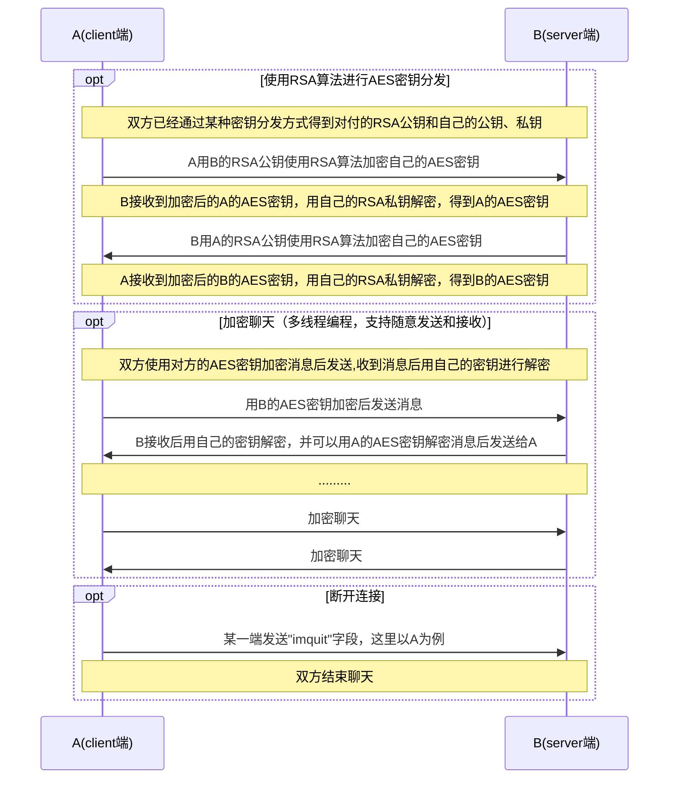

$\color{red}{NKU同学参考的话请给STAR}$
# 说明
本仓库包含了密码学课程的五个实验的代码和报告。本科的代码貌似年年都换，每年都不太一样，但是不会出圈，因此我都传上来一些。主要提供了一些前人的代码（不一定对，不一定能跑）。因此，本仓库的所有代码仅供参考。

# 友链
同时提供一些友链，大家可以自己参考看一看。
- [友链1](https://github.com/wanghanwei8/Crypto)
- [友链2](https://github.com/nkuwhjhhh/nku-cryptology)
- [友链3](https://github.com/kypomon/NKU_cryptography_project)
- [友链4](https://github.com/shesl-meow/nkcrypto)
- [友链5](https://github.com/caijiqhx/crypto_lab)
- [友链6](https://github.com/Rainefly/Cryptology)
# WARNING!
千万不要试图运行本仓库的代码，也不要试图看懂逻辑后复现，更不要试图在此基础上修改以期望得到正确代码。

# NOTICE!
注意，这里的代码都是我智慧的残渣，因为基本上每个年级到了本学期的课都实在是太多了，因此大多数的代码都不具有原创性，而且很多代码故意糊弄，不一定能跑。**因此，尤其不要直接COPY下来提交，这会使你陷入万劫不复的境地。**

# 本课复习资料
老规矩，在NKUG网自救资料那个仓库里。

# 大作业
上传了我的作业和参考文件

